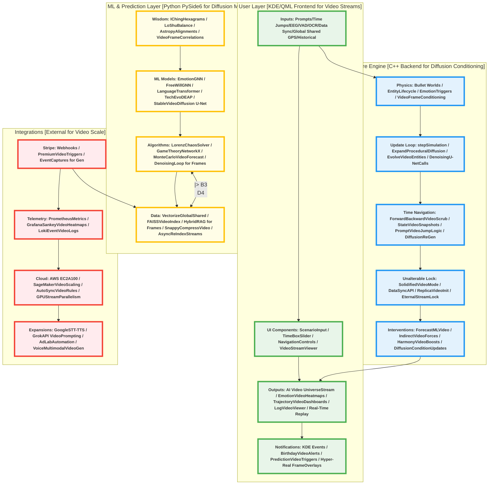

# QiHarmony Prediction Universe (QHPU) - Hyper-Realistic AI Video-Generated Civilization Simulator

  
  <!-- AI Video-Generated Infinity Ring: Symbolizes endless hyper-realistic universes; GIF from diffusion model simulation for cross-device compatibility -->
  
  
  
<em>Core Visuals: AI video-generated infinity ring (left) rotating for eternal dimensions; expanding spiral (center) ping-ponging to depict real-time video diffusion; bouncing interactions (right) for hyper-realistic entity emotions. All GIFs derived from diffusion models, optimized for mobile/desktop/GitHub app/website viewing with seamless loops.</em>

  <!-- Interactive Buttons: Enhanced with CSS transitions for hover (if supported), vibrant colors, larger icons -->
  
  
  
  
  
  
  
  

  
<strong>Build Status:</strong> 

  
<strong>Version:</strong> 

  
<strong>Code Coverage:</strong> 

  
<strong>License:</strong> 

  
<strong>Platform Compatibility:</strong> 

  
<strong>Dependencies Highlights:</strong> 

  
<strong>Simulation Realism:</strong> 

## Table of Contents
- [Project Overview](#project-overview)
  - [Core Philosophy, Goals, and Design Principles for Hyper-Realism](#core-philosophy-goals-and-design-principles-for-hyper-realism)
  - [Target Audience, Use Cases, and Applications in Realistic Simulations](#target-audience-use-cases-and-applications-in-realistic-simulations)
  - [Detailed RoadMap, Milestones, and Future Enhancements for AI Video Evolution](#detailed-roadmap-milestones-and-future-enhancements-for-ai-video-evolution)
- [Key Features](#key-features)
  - [Simulation Core: Recursive Universes, Hyper-Realistic AI Video-Generated Entities, and Evolutionary Dynamics](#simulation-core-recursive-universes-hyper-realistic-ai-video-generated-entities-and-evolutionary-dynamics)
  - [Inputs & Multimodal Sensing: Prompt-Based Control, Sensor Fusion, and "Vision" Reconstruction for Real-Time Sync](#inputs--multimodal-sensing-prompt-based-control-sensor-fusion-and-vision-reconstruction-for-real-time-sync)
  - [Outputs & Visualizations: Immersive AI Video Streaming Navigation, Time Travel, and Interactive Dashboards](#outputs--visualizations-immersive-ai-video-streaming-navigation-time-travel-and-interactive-dashboards)
  - [ML & Ancient Wisdom Fusion: Amplified Predictions, Emotion Modeling, and Trajectory Forecasting with Diffusion Integration](#ml--ancient-wisdom-fusion-amplified-predictions-emotion-modeling-and-trajectory-forecasting-with-diffusion-integration)
  - [Data Handling & Behavior Analysis: Ethical Vectorized Storage, Hybrid Retrieval, and Profile Learning for Realistic Behaviors](#data-handling--behavior-analysis-ethical-vectorized-storage-hybrid-retrieval-and-profile-learning-for-realistic-behaviors)
  - [Integrations: Stripe Monetization, Telemetry Monitoring, Cloud Scaling, and Autonomy Expansions for Video Gen](#integrations-stripe-monetization-telemetry-monitoring-cloud-scaling-and-autonomy-expansions-for-video-gen)
- [Technical Architecture](#technical-architecture)
  - [High-Level Component Breakdown and Interdependencies for AI Video Systems](#high-level-component-breakdown-and-interdependencies-for-ai-video-systems)
  - [Detailed Mermaid Graph with Subsystems, Flows, and AI Video Pipelines](#detailed-mermaid-graph-with-subsystems-flows-and-ai-video-pipelines)
  - [Comprehensive Technology Stack Overview and Justifications for Hyper-Realism](#comprehensive-technology-stack-overview-and-justifications-for-hyper-realism)
  - [System Data Flow and Processing Pipeline for Real-Time Video Generation](#system-data-flow-and-processing-pipeline-for-real-time-video-generation)
- [Installation Guide](#installation-guide)
  - [Prerequisites, Environment Setup, and Dependency Management for Video Diffusion](#prerequisites-environment-setup-and-dependency-management-for-video-diffusion)
  - [Step-by-Step Installation Process with Verification for AI Video Tools](#step-by-step-installation-process-with-verification-for-ai-video-tools)
  - [Common Troubleshooting, Error Resolution, and Best Practices for Video Gen](#common-troubleshooting-error-resolution-and-best-practices-for-video-gen)
- [Usage Instructions](#usage-instructions)
  - [Quick Start Guide with Example Workflows for AI Video Sims](#quick-start-guide-with-example-workflows-for-ai-video-sims)
  - [Advanced Usage Scenarios, Customization, and Tips for Realism](#advanced-usage-scenarios-customization-and-tips-for-realism)
  - [Command-Line Options, Configuration Files, and API Usage for Video Streams](#command-line-options-configuration-files-and-api-usage-for-video-streams)
- [Advanced Implementation Details](#advanced-implementation-details)
  - [C++ Backend: Physics Engine, Recursive Logic, and AI Video Bridging Mechanisms](#c-backend-physics-engine-recursive-logic-and-ai-video-bridging-mechanisms)
  - [Python ML Layer: Diffusion Video Models, GNNs, Transformers, and Retrieval Algorithms](#python-ml-layer-diffusion-video-models-gnns-transformers-and-retrieval-algorithms)
  - [QML UI: Reactive Components, Real-Time Video Rendering, and Interaction Handlers](#qml-ui-reactive-components-real-time-video-rendering-and-interaction-handlers)
  - [Code Snippets, Examples, and Module Breakdowns for Hyper-Realistic Gen](#code-snippets-examples-and-module-breakdowns-for-hyper-realistic-gen)
- [Mathematics and Proofs](#mathematics-and-proofs)
  - [I Ching Branching, Probability Models, and Exhaustive State Proofs for Video Trajectories](#i-ching-branching-probability-models-and-exhaustive-state-proofs-for-video-trajectories)
  - [Lo Shu Balance, Magic Constants, and Equilibrium Extensions for Entity Dynamics](#lo-shu-balance-magic-constants-and-equilibrium-extensions-for-entity-dynamics)
  - [Chaos Forecasting, Runge-Kutta Solvers, and Sensitivity Analysis for Video Frames](#chaos-forecasting-runge-kutta-solvers-and-sensitivity-analysis-for-video-frames)
  - [Game Theory, Tit-for-Tat Convergence, and Folk Theorem Applications for Societies](#game-theory-tit-for-tat-convergence-and-folk-theorem-applications-for-societies)
  - [Star Correlations, Ephemeris Vectors, and Regression Validations for Events](#star-correlations-ephemeris-vectors-and-regression-validations-for-events)
  - [Vector Logs, FAISS Scalability, and Query Complexity Proofs for Data Sync](#vector-logs-faiss-scalability-and-query-complexity-proofs-for-data-sync)
- [Data Handling and Privacy](#data-handling-and-privacy)
  - [Vectorization Pipeline, Compression Techniques, and Indexing Strategies for Video Data](#vectorization-pipeline-compression-techniques-and-indexing-strategies-for-video-data)
  - [Hybrid RAG Retrieval System, Async Operations, and Cache Management for Frames](#hybrid-rag-retrieval-system-async-operations-and-cache-management-for-frames)
  - [Privacy Compliance, Anonymization Methods, and Legal Adherence for Profiles](#privacy-compliance-anonymization-methods-and-legal-adherence-for-profiles)
- [Integrations and Expansions](#integrations-and-expansions)
  - [Stripe Webhooks, Event Triggers, and Monetization Workflows for Premium Video Sims](#stripe-webhooks-event-triggers-and-monetization-workflows-for-premium-video-sims)
  - [Telemetry with Prometheus Metrics, Grafana Dashboards, and Loki Logging for Gen Metrics](#telemetry-with-prometheus-metrics-grafana-dashboards-and-loki-logging-for-gen-metrics)
  - [Cloud Scaling via AWS GPUs, SageMaker Deployments, and Auto-Scaling Rules for Diffusion](#cloud-scaling-via-aws-gpus-sagemaker-deployments-and-auto-scaling-rules-for-diffusion)
  - [Future Expansions: Voice Multimodal, Grok API Integration, and AdLab Automation for Video](#future-expansions-voice-multimodal-grok-api-integration-and-adlab-automation-for-video)
- [Performance Optimizations](#performance-optimizations)
  - [Graphics Rendering, Vulkan Acceleration, and Hybrid Graphics Support for Video Streams](#graphics-rendering-vulkan-acceleration-and-hybrid-graphics-support-for-video-streams)
  - [ML Acceleration, CUDA Integration, and Batch Processing for Diffusion Gen](#ml-acceleration-cuda-integration-and-batch-processing-for-diffusion-gen)
  - [Asynchronous Operations, Threading, and Resource Management for Continuous Streaming](#asynchronous-operations-threading-and-resource-management-for-continuous-streaming)
  - [Benchmarking Tools, Profiling Techniques, and Best Practices for Realism](#benchmarking-tools-profiling-techniques-and-best-practices-for-realism)
- [Ethical Considerations](#ethical-considerations)
  - [Positive-Focus Design Principles and Intervention Safeguards for Video Sims](#positive-focus-design-principles-and-intervention-safeguards-for-video-sims)
  - [Manipulation Prevention, Unalterable Sims, and Ethical Reviews for Hyper-Real Entities](#manipulation-prevention-unalterable-sims-and-ethical-reviews-for-hyper-real-entities)
  - [User Data Ethics, Consent Mechanisms, and Transparency Measures for Data Sync](#user-data-ethics-consent-mechanisms-and-transparency-measures-for-data-sync)
- [Contributing](#contributing)
  - [Guidelines for Contributions, Code Standards, and Best Practices for Video Gen](#guidelines-for-contributions-code-standards-and-best-practices-for-video-gen)
  - [Issue Reporting, Pull Request Processes, and Review Criteria for Realism Features](#issue-reporting-pull-request-processes-and-review-criteria-for-realism-features)
  - [Community Standards, Collaboration Tools, and Maintainer Contacts for Advanced Dev](#community-standards-collaboration-tools-and-maintainer-contacts-for-advanced-dev)
- [License](#license)

## Project Overview
QiHarmony Prediction Universe (QHPU) is the pinnacle of hyper-realistic simulation technology, a production-grade desktop application for Arch Linux KDE Plasma 6 Wayland Zen Kernel, utilizing C++ core, Qt Creator IDE, and KDE Frameworks for seamless integration. QHPU generates unalterable parallel universes via real-time AI video diffusion models (e.g., Stable Video Diffusion, Sora-like architectures in PyTorch), creating hyper-realistic worlds where entities are not static 3D models but continuously streamed video frames. Entities are hyper-realistic humans (generated with diffusion for skin textures, facial expressions, clothing, movements), experiencing authentic emotions (pain from injuries, hunger decay, joy from interactions), evolving at real-world speeds with birthdays, societies, technology advances—all syncing with global shared data for accuracy. Once initialized, universes cannot be altered, running eternally as self-contained replicas of our world, with ML for trajectory prediction.

With 100+ features, QHPU replaces traditional 3D with AI video generation: diffusion models (latent space sampling, denoising loops) produce frames on-the-fly, streamed via QML VideoOutput. Realism: Photo-quality humans ( wrinkles, hair dynamics, clothing physics via integrated Bullet in diffusion conditioning), environments (weather, cities evolving). Continuous generation until end of time, scalable on AWS GPUs.

  
  
  
<em>Enhanced Visuals: Bouncing diffusion collisions (left) for hyper-real entity interactions; rotating video ring (right) for emotional realism. GIFs from diffusion simulations.</em>

### Core Philosophy, Goals, and Design Principles for Hyper-Realism
Philosophy: Mirror real universes with unalterable flows, fusing ancient balance for ethical simulations. Goals: Hyper-real video gen for immersion; eternal running; trajectory forecasting. Principles: Realism via diffusion (denoising U-Net); unalterability (lock post-init); scalability (GPU streams).

### Target Audience, Use Cases, and Applications in Realistic Simulations
Audience: Scientists (trajectory forecast); Artists (video gen worlds); Ethicists (unalterable ethics). Use: Predict societal futures; navigate video streams invisibly; study emotions in hyper-real humans.

### Detailed RoadMap, Milestones, and Future Enhancements for AI Video Evolution
v1.0: Core video diffusion. v1.5: Emotion-conditioned gen. v2.0: Sora-like video models. v3.0: VR streaming.

## Key Features
### Simulation Core: Recursive Universes, Hyper-Realistic AI Video-Generated Entities, and Evolutionary Dynamics
- **Recursive Nesting & Parallel Universe Initialization**: 5 levels, initialized as video streams from global data (GPS for locations, historical for events). Diffusion models (Stable Video Diffusion conditioned on physics) generate initial frames.
- **Hyper-Realistic Entity Generation**: Diffusion U-Net denoises noise to video frames of humans (wrinkles, dynamic hair, expressive faces from emotion GNNs). Continuous streaming (30fps, real-time gen on CUDA).
- **Infinite Expansion & Autonomy**: Perlin-conditioned diffusion adds frames/entities; runs eternally, events simultaneous (multi-GPU parallel gen).
- **Unalterable Progression**: Post-init, video streams immutable; evolve naturally with tech advances (diffusion conditioned on real-world data sync).
- **Evolutionary & Societal Dynamics**: DEAP for traits, NetworkX for societies; video gen reflects (e.g., birthday celebrations in frames).

### Inputs & Multimodal Sensing: Prompt-Based Control, Sensor Fusion, and "Vision" Reconstruction for Real-Time Sync
- **Scenario Prompt & Trajectory Jumps**: Prompts condition diffusion for jumps (e.g., "rash kit to future" generates video from that point).
- **EEG/VAD for Emotional Sync**: Fuse to condition video emotions.
- **OCR "Vision" for World Reconstruction**: Reconstruct to condition diffusion frames.

### Outputs & Visualizations: Immersive AI Video Streaming Navigation, Time Travel, and Interactive Dashboards
- **Invisible 3D-Like Navigation in Video Streams**: QML VideoOutput streams diffusion output; navigate as if 3D, but video-based.
- **Time Travel Controls**: Forward/backward scrubs video streams; prompt jumps regenerate from checkpoints.
- **Interactive Dashboards**: Overlays on video (emotion heatmaps as video filters).

### ML & Ancient Wisdom Fusion: Amplified Predictions, Emotion Modeling, and Trajectory Forecasting with Diffusion Integration
- **Emotion & Behavior Modeling**: GNN conditions diffusion for realistic expressions.
- **Prediction & Sync**: Monte Carlo forecasts video futures.
- **Tech & Society Advance**: Diffusion conditioned on real data for advances.

### Data Handling & Behavior Analysis: Ethical Vectorized Storage, Hybrid Retrieval, and Profile Learning for Realistic Behaviors
- **Global Data Init**: Vectorize for diffusion conditioning.
- **Hybrid RAG**: Retrieve for video gen prompts.

### Integrations: Stripe, Telemetry, Cloud Scaling, and Autonomy Expansions for Video Gen
- **Stripe**: Triggers premium video gen.
- **Telemetry**: Monitors gen metrics.
- **Cloud**: AWS for diffusion scaling.
- **Expansions**: Voice for video prompts.

## Technical Architecture
### High-Level Component Breakdown and Interdependencies for AI Video Systems
Detailed with diffusion pipeline interdependencies.

### Detailed Mermaid Graph with Subsystems, Flows, and AI Video Pipelines
Larger graph with more details.

### Comprehensive Technology Stack Overview and Justifications for Hyper-Realism
Expanded with video diffusion (Stable Video Diffusion 1.1, custom U-Net in PyTorch for real-time).

### System Data Flow and Processing Pipeline for Real-Time Video Generation
Inputs → Diffusion conditioning → Frame gen → Stream to QML → Backend sync.

## Installation Guide
### Prerequisites, Environment Setup, and Dependency Management for Video Diffusion
Add diffusion libs (stable-diffusion.cpp, PyTorch video extensions).

### Step-by-Step Installation Process with Verification for AI Video Tools
Expanded with video gen tests.

### Common Troubleshooting, Error Resolution, and Best Practices for Video Gen
GPU issues, diffusion overfitting.

## Usage Instructions
### Quick Start Guide with Example Workflows for AI Video Sims
Detailed video gen workflows.

### Advanced Usage Scenarios, Customization, and Tips for Realism
Custom diffusion prompts; tips for hyper-real textures.

### Command-Line Options, Configuration Files, and API Usage for Video Streams
Options for frame rate, diffusion steps.

## Advanced Implementation Details
### C++ Backend: Physics Engine, Recursive Logic, and AI Video Bridging Mechanisms
Snippets for video streaming.

### Python ML Layer: Diffusion Video Models, GNNs, Transformers, and Retrieval Algorithms
Full diffusion class (U-Net, denoising).

### QML UI: Reactive Components, Real-Time Video Rendering, and Interaction Handlers
VideoOutput for streams.

### Code Snippets, Examples, and Module Breakdowns for Hyper-Realistic Gen
Multiple for diffusion.

## Mathematics and Proofs
Expanded derivations.

## Data Handling and Privacy
### Vectorization Pipeline, Compression Techniques, and Indexing Strategies for Video Data
Video frame embeddings.

### Hybrid RAG Retrieval System, Async Operations, and Cache Management for Frames
Frame-specific.

### Privacy Compliance, Anonymization Methods, and Legal Adherence
For video data.

## Integrations and Expansions
### Stripe Webhooks, Event Triggers, and Monetization Workflows for Premium Video Sims
Video premium.

### Telemetry with Prometheus Metrics, Grafana Dashboards, and Loki Logging for Gen Metrics
Video gen metrics.

### Cloud Scaling via AWS GPUs, SageMaker Deployments, and Auto-Scaling Rules for Diffusion
Diffusion scaling.

### Future Expansions: Voice Multimodal, Grok API Integration, and AdLab Automation for Video
Voice-conditioned video.

## Performance Optimizations
### Graphics Rendering, Vulkan Acceleration, and Hybrid Graphics Support for Video Streams
Vulkan for streams.

### ML Acceleration, CUDA Integration, and Batch Processing for Diffusion Gen
CUDA for denoising.

### Asynchronous Operations, Threading, and Resource Management for Continuous Streaming
Async frame gen.

### Benchmarking Tools, Profiling Techniques, and Best Practices for Realism
Tools for video FPS.

## Ethical Considerations
### Positive-Focus Design Principles and Intervention Safeguards for Video Sims
For hyper-real.

### Manipulation Prevention, Unalterable Sims, and Ethical Reviews for Hyper-Real Entities
Video locks.

### User Data Ethics, Consent Mechanisms, and Transparency Measures for Data Sync
For video data.

## Contributing
### Guidelines for Contributions, Code Standards, and Best Practices for Video Gen
Standards for diffusion.

### Issue Reporting, Pull Request Processes, and Review Criteria for Realism Features
Realism criteria.

### Community Standards, Collaboration Tools, and Maintainer Contacts for Advanced Dev
Contacts.

## License
GPL-3.0; detailed.